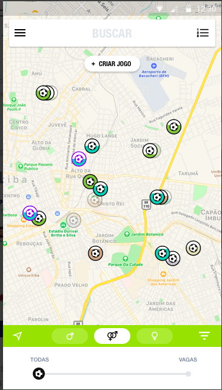
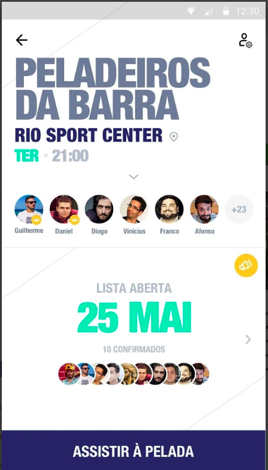
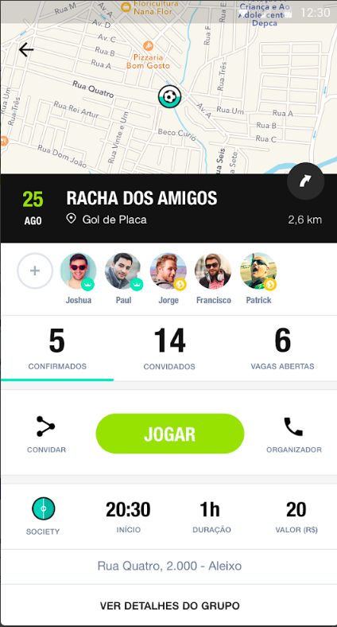
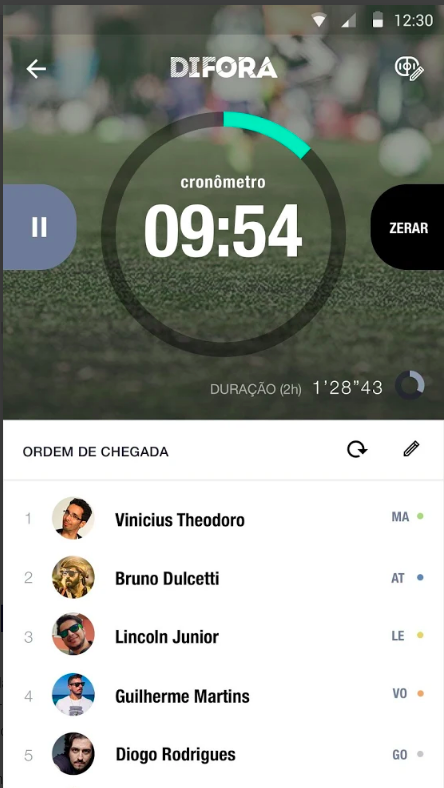
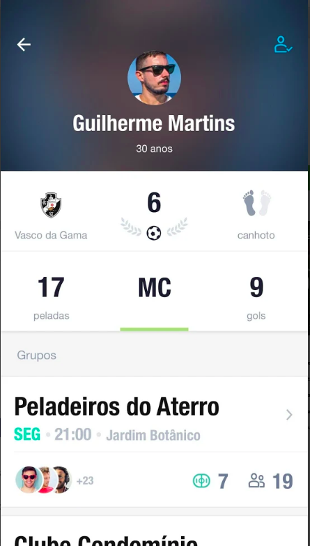

O DIFORA conecta você a peladeiros por todo o país, seja para buscar uma nova atividade para se integrar ou mesmo encontrar novos participantes para se juntar ao seu grupo. Afinal, o mais importante nessa vida é não deixar a pelada morrer.

Com um visual atraente e funcionalidades simples de usar, o DIFORA chega para elevar a experiência do peladeiro à outro nível, e provar que, no país do futebol, pelada também é coisa séria.

Algumas das funcionalidades que você encontra no app:

• Encontrar locais (quadras, campos, etc) para jogar com seus amigos;
• Encontrar novos grupos com vagas para se juntar;
• Criar seu próprio grupo de futebol entre amigos;
• Marcar jogos para seu grupo;
• Convidar amigos para jogar;
• Abrir vagas para novos participantes em seu grupo;
• Adicionar amigos ou se conectar a novos peladeiros;
• Criar grupos com um visual exclusivo para mulheres;
• Confirmar presença num jogo;
• permite ao administrador do grupo gerenciar seus membros, confirmando presença e chegada na atividade;
• Adicionar novos administradores ao seu grupo;
• Habilitar/desabilitar controle de artilharia no grupo;
• Controlar lista de presença por ordem de chegada;
• Controlar de gols durante as partidas;
• Cronômetro exclusivo para controle das partidas;
• Eleger o "Home do Jogo" da rodada;
• Criar seu perfil de peladeiro com histórico de partidas e gols marcados;
• Notificação automática de novo jogo marcado aos membros do grupo;
• Compartilhar o DIFORA com amigos de forma simples.

